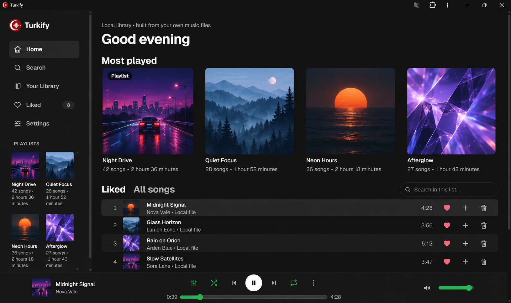
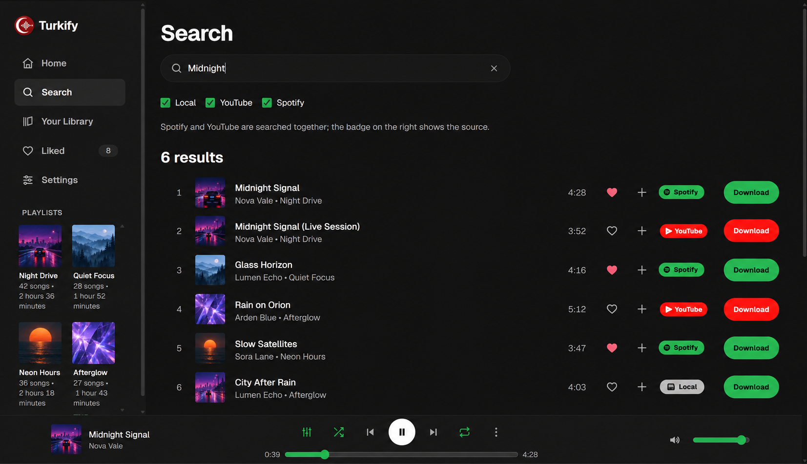
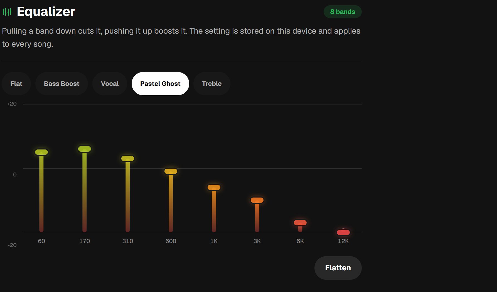
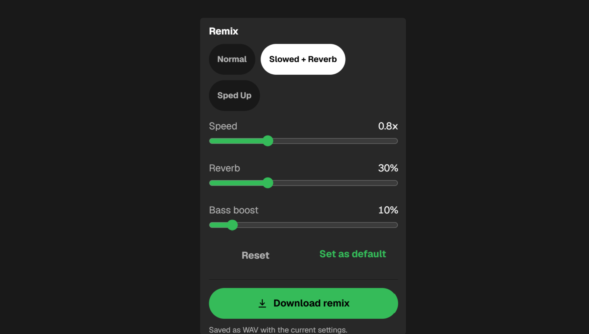
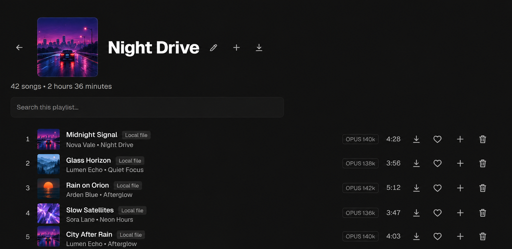
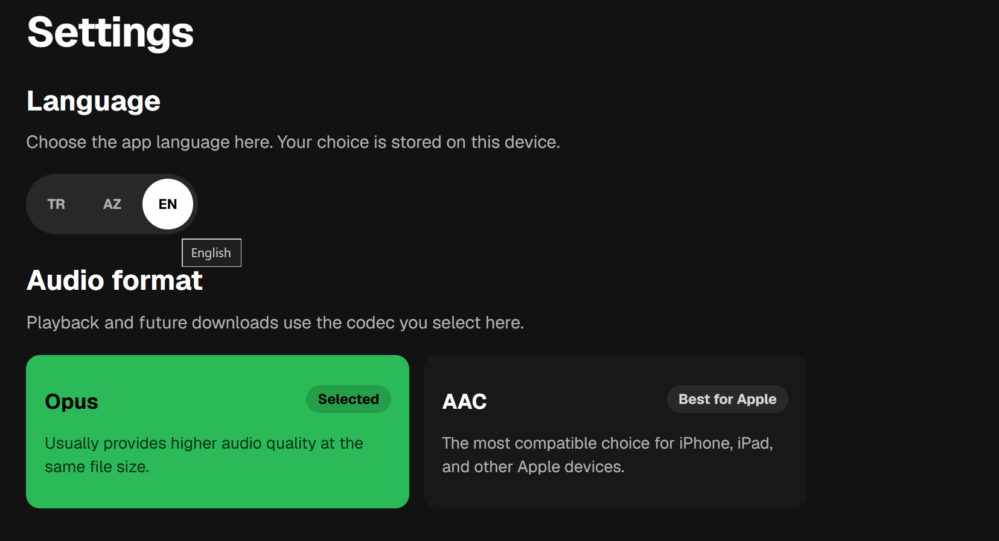
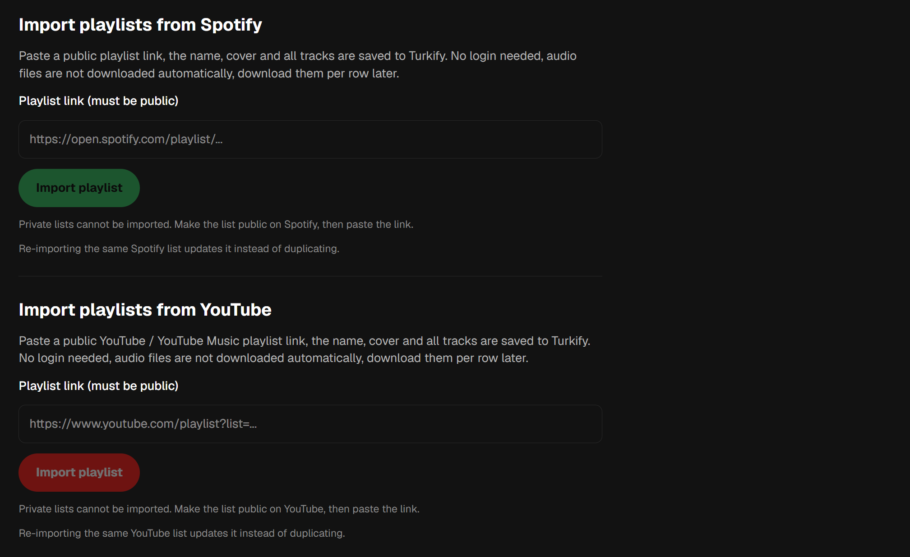

# Turkify

Turkify is my personal music app. It lives in the browser. No installer, just search, playlists, likes, downloads, an equalizer and a small remix panel in one tab.

Note: This is the public showcase. The full app is shared separately by invite.

## What it looks like

Home collects your most played playlists and your liked songs, with the player bar pinned to the bottom on every page.

### Equalizer

That search page searches your local files, YouTube and Spotify at the same time. Each row wears a badge showing where it came from with its sound quality badge, and each song downloads on its own to your local. 

### Equalizer

You can set your own eqo with 8 bands, 60 Hz to 12 kHz. Presets cover the usual suspects: Flat, Bass Boost, Vocal, Treble, plus one called Pastel Ghost. Drag a band down to cut, up to boost. App will remember your eqo and apply to every song.

### Remix

There's 3 quick remix profiles: "Normal" "Slowed + Reverb" "Sped Up" with three sliders underneath for speed, reverb and bass boost. Remix won't lower the quality of the music so you can set freely. Reset button keep it as that song's default, and download button downloads the remix version to your local device.

Another good thing is, if you set a remix to a song and click to "Set as default" button, app will always use that remix when that music opens.

### Playlist

Cover up top, song count and total runtime next to it, a search box when the list gets long. Rows you already downloaded carry their codec and bitrate.

### Language and audio format

You can choose 3 languages to use the app: Turkish, Azerbaijani, English. Same page decides the codec for playback and future downloads, Opus packing more quality into the same file size while AAC is better on iPhones.

### Import from Spotify and YouTube

Paste a public playlist link. Turkify keeps the name, the cover and the track list, no login on either side. Files don't come down by themselves. You grab them row by row, later, whenever. 

Note: Private lists are invisible to the app, so make them public first.

## Setup

Short version. Details live in the folder READMEs:

- Windows (`Turkify windows/`): install Node.js 22+, Python 3.12, FFmpeg and Deno, then `python -m pip install "yt-dlp[default]" spotdl spotapi`. Double-click `Launcher.bat`, the browser opens at `http://localhost:3400`.
- macOS (`turkify mac/`): run `bash Setup.command`, then open `Turkify.app`. The browser opens at `http://127.0.0.1:3401`.

## Warnings

- Personal use only. No DRM bypass in here, so only pull down stuff you actually have the right to use.
- Closing the tab doesn't stop the server. Windows: `Durdur.bat`, or the stop button under Settings, Server. macOS: `Stop.command`.
- Search and downloads phone third-party services, which is how a Spotify match can resolve to YouTube audio.
- The mac app is unsigned and not notarized, so right-click, Open on first launch, and only if you trust where it came from.
- Keys and preferences live in browser storage. No vault there.
- Screenshots show a sample library, not a real collection.

## License

Shared license in the root `LICENSE` file.
